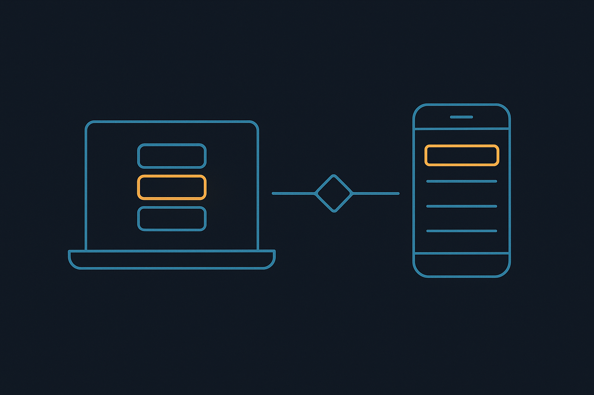
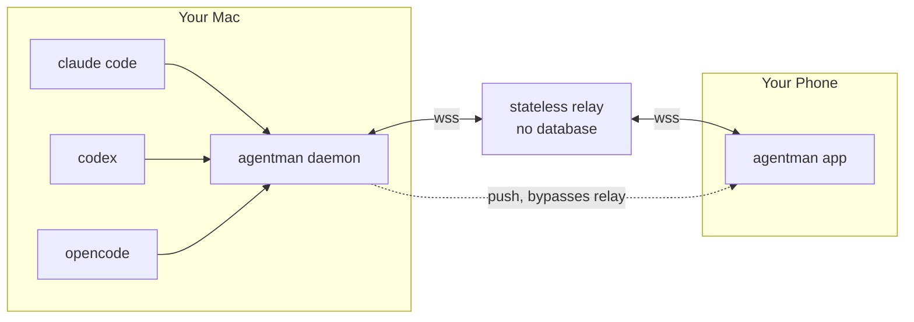
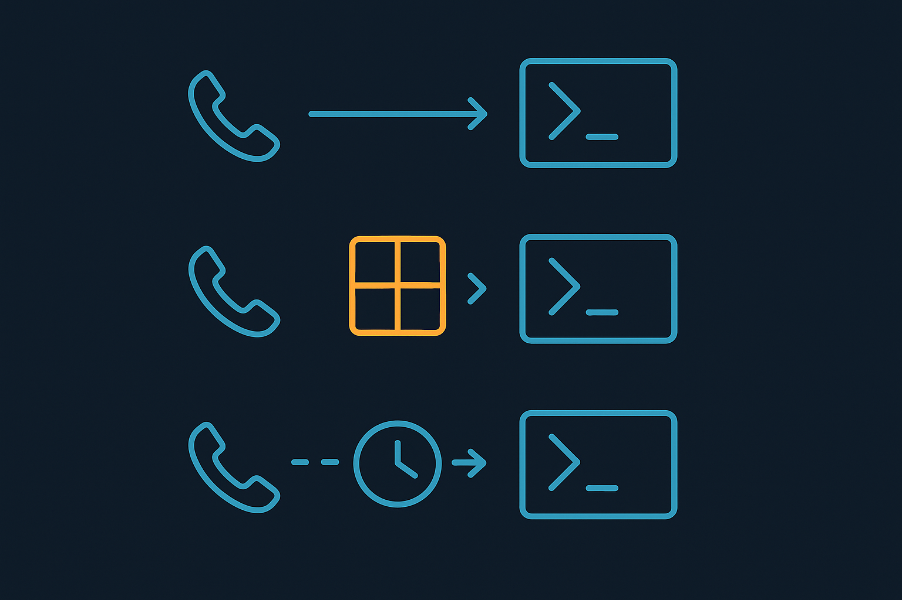

<div align="center">



# agentman

**Watch your coding agents from your phone — and answer them when they get stuck.**

[](LICENSE)
[](https://go.dev)
[](#the-relay-stores-nothing)

</div>

Start a Claude Code, Codex, or OpenCode session on your machine and it shows up on
your phone: what it's doing right now, what it has already done, and a box to send
it your next instruction. When an agent finishes, your phone tells you. When an
agent stops to ask permission, you can answer it from wherever you are.

---

## Quick start

```bash
brew install lenajeremy/agentman/agentman

am install-hooks          # exact "it's done" signals instead of polling
am serve                  # leave this running
am pair                   # prints a 6-digit code for the app
```

`am` talks to the public relay by default, so there is nothing to configure.
To use your own, set `AGENTMAN_RELAY` or pass `--relay`; to run with no relay
at all, pass `--relay none`.

Then start an agent through the wrapper so you can message it back:

```bash
am claude                 # instead of `claude`
am codex                  # instead of `codex`
```

That's it. `am list` will show your sessions in the terminal too, if you'd rather
not use the app at all.

---

## The relay stores nothing

The obvious design puts your transcripts in a database on a server. This one
doesn't, and that single constraint shapes everything else.

Your agent transcripts already exist on your own disk. The daemon reads them
there and streams them to your phone on demand — live for the session you are
looking at, pulled page by page when you scroll back. The relay in the middle
matches two sockets and forwards bytes between them.

So the relay needs **no database at all**. Device tokens are signed and
re-verified rather than stored. Accounts are derived by hashing your daemon
token, so there is no user table and no registration step. Pairing codes live in
memory for sixty seconds. Notifications go from your machine straight to the
notification service. Restart the relay and nothing is lost but reconnections.

That is the point: **the relay holds nothing, so it doesn't matter whose relay
you use.** Use the public one above, [deploy your own](#self-hosting-the-relay),
or skip it entirely and run the daemon on your LAN.

Two honest trade-offs:

- **A closed laptop means an empty app.** With no server-side cache there is
  nothing to show. Mostly self-correcting — there are no live agents when your
  Mac is asleep — and the app says "your Mac is offline · last seen 2h ago"
  rather than showing a blank screen.
- **Scrollback is a real algorithm**, not a SQL `LIMIT`. See
  [`internal/jsonl`](internal/jsonl/jsonl.go).

---

## How it fits together



The daemon is the only component that touches agent data, and the only one that
holds any. The relay is a pipe. The app is a view. That concentration is
deliberate — it is what allows the relay to store nothing.

| Data | Direction | Why |
|---|---|---|
| Session list | push, daemon → app | Metadata only. Small, always live. |
| New messages | push, **subscribed session only** | The app subscribes on screen focus and drops it on blur, so idle sessions cost nothing. |
| Scrollback | pull, app → daemon | Read from disk on demand with an opaque cursor. |
| Notifications | daemon → push service | Never touches the relay. |

---

## How it finds your agents

Each CLI has one adapter in [`internal/source`](internal/source). None of these
formats are published APIs, so every assumption is isolated there and covered by
tests.

| | Discovery | Scrollback | Send a message |
|---|---|---|---|
| **Claude Code** | `~/.claude/sessions/<pid>.json`, a live registry with a busy/idle status, verified against the pid because the file outlives a crash | `~/.claude/projects/<cwd-slug>/<id>.jsonl` | tmux (mid-turn) or the hook queue |
| **Codex** | Rollout files under `~/.codex/sessions/`, **plus any tmux pane running `codex`** — Codex writes no rollout until its first turn, so the pane is the only evidence a session exists before then | same rollout file | tmux (mid-turn) or the hook queue |
| **OpenCode** | `opencode serve`'s HTTP API, which reports exactly which sessions are running | `GET /api/session/:id/message`, cursor-paged | `POST .../prompt` with `delivery: steer` — native, mid-turn |

**OpenCode is the one agent that needs no tricks.** A real API covers sessions,
messages, mid-turn delivery, and questions as structured data. It is the shape
[`source.Source`](internal/source/source.go) was designed around and the best
reference for adding a fourth agent.

Findings worth recording, since none are documented anywhere:

- **Codex's hooks do not fire.** Its binary contains `hooks.json` and the same
  event names as Claude Code, and agentman registers them — but a live session
  produced no deliveries at all. `am doctor` reports "registered, never
  observed" rather than a green check, and Codex falls back to polling. Claude
  Code's hooks are verified working.
- **Each CLI picked a different selection marker.** Claude Code uses `❯`
  (U+276F), Codex uses `›` (U+203A). Missing one is not cosmetic — the unmatched
  line stops being an option and gets read as the question instead, silently
  dropping a choice.
- **Codex writes two overlapping streams.** `response_item` is the raw model
  history; `event_msg` is what its UI renders. They duplicate each other almost
  exactly, so only `event_msg` is read.
- **OpenCode's OpenAPI spec disagrees with its own responses** in three places:
  the session list is wrapped in `{data, cursor}`, the working directory lives
  under `location`, and messages are flat rather than `{info, parts}`. Check the
  wire, not the schema.

---

## Sending a message to a running agent



Agent CLIs are interactive terminal programs with no input API, so the last hop
is the hard part. Every session shows which of three paths it has, because they
are not equally good and the app refuses to imply otherwise.

| Mode | How | Quality |
|---|---|---|
| `api` | OpenCode's own endpoint | Instant, works **mid-turn** |
| `tmux` | Started with `am claude` / `am codex`, so the daemon types into it | Instant, works **mid-turn** |
| `hook` | Queued, handed over at the session's next `Stop` hook | Between turns only, and the CLI can discard it |
| `none` | No route — the composer is disabled | — |

```bash
am claude                                  # a session you can message later
am send claude:abc123 "run the tests and tell me what fails"
```

Two details that matter more than they look:

- **The prompt box is cleared first.** Typing on top of a half-written draft
  fuses them into one garbled prompt — a real bug this hit, where a draft
  `this is false` turned an injected message into `this is falserun the tests`.
  `Ctrl-U` puts the draft in the kill ring, so `Ctrl-Y` restores it; a nonsense
  prompt already sent to the agent is not recoverable at all.
- **Multi-line messages use bracketed paste.** Raw newlines would submit at the
  first line break and scatter the rest across follow-up turns.

---

## Answering the prompts that block an agent

When an agent asks "can I run this command?", it stops until someone answers.
That is the state most worth a notification, and the one the app makes
actionable: the question, the exact command under review, and the choices all
appear on the phone, and tapping one answers the real agent.

Finding these is harder than it sounds:

- **No hook fires for a permission prompt.** Verified by sitting on a live
  prompt with the daemon attached and waiting.
- **The session registry still says `idle`.** From the outside, an agent blocked
  on a decision is indistinguishable from one that has finished.

So detection reads the terminal itself — `tmux capture-pane`, parsed by
[`internal/question`](internal/question/question.go). That carries a real cost:
**only sessions started with `am claude` / `am codex` can be seen or answered
this way.** OpenCode is exempt; its questions are structured data over the API.

The parser is deliberately conservative, since a phantom question would be worse
than a missed one: a lone numbered line reads as prose, a menu with anything
after it counts as already answered, and two options are required before
anything is reported.

---

## Install

### Homebrew (macOS)

```bash
brew install lenajeremy/agentman/agentman
```

### From source

```bash
git clone https://github.com/lenajeremy/agentman.git
cd agentman
go build -o bin/am ./cmd/am
```

Requires Go 1.24+. `tmux` is optional but needed to send messages to Claude Code
or Codex, and to answer their prompts: `brew install tmux`.

---

## Commands

```
am list                     List running agent sessions
am watch [session-id]       Follow sessions live (all, or one in detail)
am history <session-id>     Print a session's recent messages
am send <session-id> <text> Send a message to a running session
am serve                    Run the daemon (hooks + relay connection)
am pair                     Print a pairing code for your phone
am claude [args...]         Start Claude Code so you can message it later
am codex [args...]          Start Codex so you can message it later
am install-hooks            Register agentman's hooks with your agents
am uninstall-hooks          Remove them again
am doctor                   Check that everything is wired up correctly
```

`am history` prints a cursor when there is more to read:

```bash
am history claude:abc123 -limit 20
am history claude:abc123 -limit 20 -before 319250377
```

### About `install-hooks`

It edits `~/.claude/settings.json`, which is your real configuration, so it is
built around not damaging it: it backs the file up, writes atomically via
rename, preserves every key it does not own, and **refuses outright if the file
will not parse** rather than guessing. `am uninstall-hooks` removes only its own
entries, leaving any hooks you wrote alone. Run `am install-hooks -dry-run`
first to see exactly what would change.

---

## The app

The mobile app is Expo / React Native, in [`mobile/`](mobile).

```bash
cd mobile
npm install
npx expo start
```

Open it in Expo Go, enter your relay address and the code from `am pair`.

**Notifications:** Expo Go cannot receive remote push, so alerts only fire while
the app is open. For a real alarm when your phone is in your pocket you need a
development build (`eas build --profile development`), which requires an Apple
Developer account. The daemon can also post to a private `ntfy.sh` topic if you
want background alerts without that.

Pinned to **Expo SDK 54**. TypeScript is pinned to 5.9 because TypeScript 7
breaks the SDK 54 CLI.

---

## Self-hosting the relay

The public relay at `agentman-production.up.railway.app` stores nothing, so
using it costs you no privacy — but you never have to.

**Docker:**

```bash
docker build -t agentman-relay .
docker run -p 8080:8080 -e AGENTMAN_RELAY_SECRET="$(openssl rand -hex 32)" agentman-relay
```

**Railway:**

```bash
railway up
railway variables --set "AGENTMAN_RELAY_SECRET=$(openssl rand -hex 32)"
railway domain
```

**No relay at all:** point the app straight at your machine over your LAN or a
Tailscale address. Same protocol, one less hop.

`AGENTMAN_RELAY_SECRET` signs device tokens and **must stay stable across
restarts** — changing it invalidates every paired device, which looks like a
mysterious logout rather than a config change. The relay refuses to start
without it rather than generating one that would silently change.

Point the daemon at your relay with `am serve --relay https://your-relay`, or
set `AGENTMAN_RELAY` once and drop the flag. Precedence is flag, then
environment, then the built-in default. `--relay none` disables it entirely —
the daemon still watches your agents and prints locally, it just is not
reachable from your phone.

---

## Security

- The relay sees frames in transit but **stores none of them**. Every endpoint
  authenticates with a bearer token or a single-use pairing code, and no cookies
  are set.
- Accounts are derived by hashing your daemon token, so the relay never sees or
  stores the token itself.
- Pairing codes are six digits, single-use, expire in sixty seconds, and burn
  after five failed attempts — a million-wide space is otherwise walkable inside
  a minute.
- Hook deliveries are authenticated with a token from a `0600` file rather than
  argv, since `ps` is world-readable and the loopback listener would otherwise
  accept a forged "turn complete" from any local process.
- The frame envelope keeps its body in a single opaque field, so end-to-end
  encryption is a drop-in later. **It is not implemented yet** — run your own
  relay if that matters to you today.

---

## Contributing

The interesting extension point is
[`source.Source`](internal/source/source.go): `Discover`, `Page`, `Follow`, and
optionally `Inject` and `Answer`. Adding Gemini CLI, Grok CLI, or Amp means one
file there and a line in the registry — nothing else changes.

```bash
go test ./...
cd mobile && npx tsc --noEmit
```

Tests use fixtures captured verbatim from real sessions, because every
interesting bug in this project came from the real thing disagreeing with the
documentation.

---

## License

MIT
