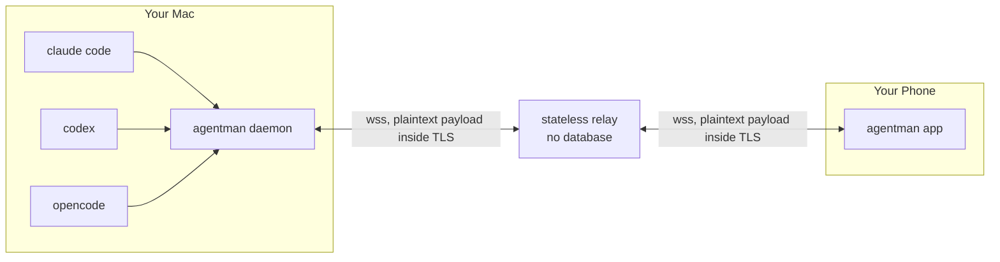

<div align="center">


# agentman

**Watch your coding agents from your phone — and answer them when they get stuck.**

[](LICENSE)
[](https://go.dev)
[](#the-relay-has-no-database)

</div>

Start a Claude Code, Codex, or OpenCode session on your machine and it shows up on
your phone: what it's doing right now, what it has already done, and a box to send
it your next instruction. When an agent finishes, your phone tells you. When an
agent stops to ask permission, you can answer it from wherever you are.

---

## Quick start

```bash
brew install lenajeremy/agentman/agentman

am install-hooks          # exact "it's done" signals instead of polling
am serve                  # leave this running
am pair                   # prints a QR code to scan
```

`am` talks to the public relay by default, so there is nothing to configure.
To use your own, set `AGENTMAN_RELAY` or pass `--relay`; to run with no relay
at all, pass `--relay none`.

Then start an agent through the wrapper so you can message it back:

```bash
am claude                 # instead of `claude`
am codex                  # instead of `codex`
am opencode               # instead of `opencode`
```

That's it. `am list` will show your sessions in the terminal too, if you'd rather
not use the app at all.

---

## The relay has no database

The obvious design puts your transcripts in a database on a server. This one
doesn't, and that single constraint shapes everything else.

Your agent transcripts already exist on your own disk. The daemon reads them
there and streams them to your phone on demand — live for the session you are
looking at, pulled page by page when you scroll back. The relay in the middle
matches two sockets and forwards bytes between them.

So the relay needs **no database at all**. Device tokens are signed and
re-verified rather than stored. Accounts are derived by hashing your daemon
token, so there is no user table and no registration step. Pairing codes live in
memory for sixty seconds. Turn-complete events use the same live socket as
everything else, and the app turns them into local notifications. Restart the
relay and only live connections and short-lived pairing state are lost.

The privacy boundary matters: payloads are TLS-protected on each network hop,
but there is currently **no end-to-end encryption**, so the relay can observe
transcripts and control messages while forwarding them. Use the public relay
only if you trust its operator with data in transit; otherwise
[deploy your own](#self-hosting-the-relay). The useful guarantee is no
persistent server-side transcript store, not an inability to inspect traffic.

Two honest trade-offs:

- **A closed laptop means an empty app.** With no server-side cache there is
  nothing to show. Mostly self-correcting — there are no live agents when your
  Mac is asleep — and the app says "your Mac is offline · last seen 2h ago"
  rather than showing a blank screen.
- **Scrollback is a real algorithm**, not a SQL `LIMIT`. See
  [`internal/jsonl`](internal/jsonl/jsonl.go).

---

## How it fits together



The daemon is the only component that reads transcript files from disk. The
relay forwards their contents without persisting them, and the app keeps the
view it has fetched. The relay is therefore still a live confidentiality and
integrity boundary even though it has no transcript database.

| Data | Direction | Why |
|---|---|---|
| Session list | push, daemon → app | Metadata only. Small, always live. |
| New messages | push, **subscribed session only** | The app subscribes on screen focus and drops it on blur, so idle sessions cost nothing. |
| Scrollback | pull, app → daemon | Read from disk on demand with an opaque cursor. |
| Turn-complete events | daemon → relay → app | Uses the live socket; the app schedules a local notification after receipt. There is no APNs/FCM push service. |

---

## How it finds your agents

Each CLI has one adapter in [`internal/source`](internal/source). Claude and the
current Codex adapter rely partly on undocumented local formats; OpenCode uses
its supported HTTP API. Every assumption is isolated there and covered by tests.

| | Discovery | Scrollback | Send a message |
|---|---|---|---|
| **Claude Code** | `~/.claude/sessions/<pid>.json`, a live registry with a busy/idle status, verified against the pid because the file outlives a crash | `~/.claude/projects/<cwd-slug>/<id>.jsonl` | tmux (mid-turn) or the hook queue |
| **Codex** | Rollout files under `~/.codex/sessions/`, **plus any tmux pane running `codex`** — Codex writes no rollout until its first turn, so the pane is the only evidence a session exists before then | same rollout file | tmux when started with `am codex`; otherwise read-only |
| **OpenCode** | OpenCode's HTTP API, which reports exactly which sessions are running | `GET /session/:id/message`, cursor-paged | `POST /session/:id/prompt_async` — native, asynchronous |

**OpenCode is the one agent that needs no tricks.** A real API covers sessions,
messages, mid-turn delivery, and questions as structured data. It is the shape
[`source.Source`](internal/source/source.go) was designed around and the best
reference for adding a fourth agent.

It does need that API to be reachable, which is what `am opencode` is for. The
TUI serves it already, but on an ephemeral port unless told otherwise — so a
plain `opencode` is invisible to agentman with nothing on screen to say why.
`am opencode` starts it in the daemon's small watched port range. Concurrent
TUIs keep separate servers, and the daemon combines their supported `/session`,
`/question`, and `/permission` APIs so every live project stays visible. Note
there is no tmux here, unlike `am claude` and `am codex`: those need a terminal
to type into because their CLIs have no input channel, and OpenCode does not.

Findings worth recording, since none are documented anywhere:

- **Codex has one supported notification callback, not Claude-style hooks.**
  Agentman installs a top-level `notify` command in `~/.codex/config.toml` and
  normalizes its `agent-turn-complete` payload. It is fire-and-forget: it can
  signal completion but cannot carry a queued prompt back into Codex.
- **Completion has an exact path and a fallback.** Claude's `Stop` hook and
  Codex's `notify` callback win when they arrive. OpenCode and any missed hook
  fall back to the adapter's busy→idle transition, with a 15-second suppression
  window so one turn never rings twice.
- **A failed turn looks exactly like a finished one** unless you check. An
  OpenCode turn whose provider returns 503 goes busy→idle normally and produces
  an assistant message with empty content, so the notification has to fall back
  to the error text or it reads as success.
- **Each CLI picked a different selection marker.** Claude Code uses `❯`
  (U+276F), Codex uses `›` (U+203A). Missing one is not cosmetic — the unmatched
  line stops being an option and gets read as the question instead, silently
  dropping a choice.
- **Codex writes two overlapping streams.** `response_item` is the raw model
  history; `event_msg` is what its UI renders. They duplicate each other almost
  exactly, so only `event_msg` is read.
- **OpenCode's part ids are unique only inside their message.** The first text
  part of every assistant message is `text-0`. Using that as a message id made
  every reply in a session collide — the app merges by id, so the whole
  conversation folded into a single assistant row and no new reply ever
  streamed. Ids are namespaced by the message id now.
- **An OpenCode message is filled in as the model writes it**, under a stable
  id. So "have I sent this already?" cannot be answered by id alone; the live
  tail compares content, or long answers freeze at their first few words.
- **No agent records its model in a session header.** It is on individual
  assistant messages, so the model is found by reading backwards from the end of
  a transcript — and cached, because discovery runs every second against files
  that reach hundreds of megabytes. Codex writes it in two places
  (`turn_context.payload.model` and nested under `world_state`), and Claude Code
  writes `<synthetic>` for messages it generated itself.
- **OpenCode's supported API has changed across releases.** Agentman uses the
  OpenAPI-backed `/session`, `/question`, and `/permission` routes and tests the
  exact `{info, parts}` message shape, pagination header, and request payloads.

---

## Sending a message to a running agent


Agent CLIs are interactive terminal programs with no input API, so the last hop
is the hard part. Every session shows which of three paths it has, because they
are not equally good and the app refuses to imply otherwise.

| Mode | How | Quality |
|---|---|---|
| `api` | OpenCode's own endpoint | Instant, works **mid-turn** |
| `tmux` | Started with `am claude` / `am codex`, so the daemon types into it | Instant, works **mid-turn** |
| `hook` | Claude only: queued and handed over at the next `Stop` hook | Between turns only, and Claude can discard it |
| `none` | No route — the composer is disabled | — |

```bash
am claude                                  # a session you can message later
am send claude:abc123 "run the tests and tell me what fails"
```

Two details that matter more than they look:

- **The prompt box is cleared first.** Typing on top of a half-written draft
  fuses them into one garbled prompt — a real bug this hit, where a draft
  `this is false` turned an injected message into `this is falserun the tests`.
  `Ctrl-U` puts the draft in the kill ring, so `Ctrl-Y` restores it; a nonsense
  prompt already sent to the agent is not recoverable at all.
- **Multi-line messages use bracketed paste.** Raw newlines would submit at the
  first line break and scatter the rest across follow-up turns.

---

## Answering the prompts that block an agent

When an agent asks "can I run this command?", it stops until someone answers.
That is the state most worth a notification, and the one the app makes
actionable: the question, the exact command under review, and the choices all
appear on the phone, and tapping one answers the real agent.

Finding these is harder than it sounds:

- **No hook fires for a permission prompt.** Verified by sitting on a live
  prompt with the daemon attached and waiting.
- **The session registry still says `idle`.** From the outside, an agent blocked
  on a decision is indistinguishable from one that has finished.

So detection reads the terminal itself — `tmux capture-pane`, parsed by
[`internal/question`](internal/question/question.go). That carries a real cost:
**only sessions started with `am claude` / `am codex` can be seen or answered
this way.** OpenCode is exempt; its questions are structured data over the API.

The parser is deliberately conservative, since a phantom question would be worse
than a missed one: a lone numbered line reads as prose, a menu with anything
after it counts as already answered, and two options are required before
anything is reported.

---

## Install

### Homebrew (macOS)

```bash
brew install lenajeremy/agentman/agentman
```

That one-liner taps and installs in a single step. If you would rather type the
short name, tap once first:

```bash
brew tap lenajeremy/agentman
brew install agentman
```

Bare `brew install agentman` only works once the tap is added — Homebrew has no
way to find an untapped formula by name alone. Making it work with no tap at
all would mean getting into `homebrew-core`, which has its own notability bar.

### From source

```bash
git clone https://github.com/lenajeremy/agentman.git
cd agentman
go build -o bin/am ./cmd/am
```

Requires Go 1.24+. `tmux` is optional but needed to send messages to Claude Code
or Codex, and to answer their prompts: `brew install tmux`.

---

## Commands

```
am list                     List running agent sessions
am watch [session-id]       Follow sessions live (all, or one in detail)
am history <session-id>     Print a session's recent messages
am send <session-id> <text> Send a message to a running session
am serve                    Run the daemon (hooks + relay connection)
am pair                     Print a pairing code for your phone
am claude [args...]         Start Claude Code so you can message it later
am codex [args...]          Start Codex so you can message it later
am opencode [args...]       Start OpenCode so you can message it later
am install-hooks            Register agentman's hooks with your agents
am uninstall-hooks          Remove them again
am doctor                   Check that everything is wired up correctly
```

`am history` prints a cursor when there is more to read:

```bash
am history claude:abc123 -limit 20
am history claude:abc123 -limit 20 -before 319250377
```

### About `install-hooks`

It edits `~/.claude/settings.json` and adds a managed top-level `notify` entry to
`~/.codex/config.toml`. Both are real user configurations, so writes are private
(`0600`), atomic, backed up, and surgical. Claude JSON is refused outright if it
does not parse. An existing user-owned Codex `notify` command is never replaced.
`am uninstall-hooks` removes only agentman's entries. Run
`am install-hooks -dry-run` first to see exactly what would change.

---

## The app

The mobile app is Expo / React Native, in [`mobile/`](mobile).

```bash
cd mobile
npm ci
npx expo start
```

Open it in Expo Go, enter your relay address and the code from `am pair`.

**Notifications:** these are local notifications scheduled after a
`turn_complete` frame arrives over the live websocket. There is no remote push
backend, so the app cannot reliably alert after iOS or Android suspends its
socket in the background. A development build does not change that limitation.

Pinned to **Expo SDK 54**. TypeScript is pinned to 5.9 because TypeScript 7
breaks the SDK 54 CLI.

---

## Deploying the relay

The relay redeploys itself when `main` changes. Railway watches the repository
and rebuilds from [`Dockerfile`](Dockerfile), which builds only `cmd/relay` —
`railway.json` limits the trigger to paths that actually affect it, so a change
to the app or the daemon does not restart a live relay for no reason.

## Self-hosting the relay

The public relay at `agentman-production.up.railway.app` keeps no transcript
database, but it can observe live plaintext payloads. Self-host when that trust
boundary is not acceptable.

**Docker:**

```bash
docker build -t agentman-relay .
docker run -p 8080:8080 -e AGENTMAN_RELAY_SECRET="$(openssl rand -hex 32)" agentman-relay
```

**Railway:**

```bash
railway up
railway variables --set "AGENTMAN_RELAY_SECRET=$(openssl rand -hex 32)"
railway domain
```

`AGENTMAN_RELAY_SECRET` signs device tokens and **must stay stable across
restarts** — changing it invalidates every paired device, which looks like a
mysterious logout rather than a config change. The relay refuses to start
without it rather than generating one that would silently change.

Point the daemon at your relay with `am serve --relay https://your-relay`, or
set `AGENTMAN_RELAY` once and drop the flag. Precedence is flag, then
environment, then the built-in default. `--relay none` disables it entirely —
the daemon still watches your agents and prints locally, it just is not
reachable from your phone.

---

## Security

- The relay sees plaintext frame payloads in transit but does not persist
  transcripts or messages. Every endpoint authenticates with a bearer token or
  a single-use pairing code, and no cookies are set.
- Accounts are derived by hashing your daemon token. The relay necessarily sees
  that root token while authenticating the daemon and issuing a pairing code,
  but does not store it or forward it onward.
- Pairing offers two secrets for the same sixty-second window: a QR code and
  ten digits. Redeeming either retires both. The scanned secret is 128 bits,
  so guessing it is not a threat and that path needs no rate limiting at all —
  being unreadable by a human is exactly what lets it be strong. The typed code
  has to stay short, so it carries the protections below.
- Typed pairing codes are ten random digits, single-use, and expire in sixty
  seconds. Failed attempts are rate limited per caller, so one person guessing
  badly never affects anyone else, and only failures are charged — typing your
  code correctly costs nothing.
- **Self-hosting note:** the relay identifies callers by socket address unless
  you set `AGENTMAN_TRUST_PROXY=1`. Set it only when a proxy in front
  overwrites `X-Forwarded-For` (Railway does). On a directly exposed relay that
  header is whatever the caller typed, and believing it would let anyone mint a
  fresh rate-limit bucket per request.
- Hook deliveries are authenticated with a token from a `0600` file rather than
  argv, since `ps` is world-readable and the loopback listener would otherwise
  accept a forged "turn complete" from any local process.
- Native mobile credentials are kept in iOS Keychain / Android
  Keystore-backed SecureStore. The web build necessarily uses browser storage,
  and its websocket bearer appears in the query string because browsers cannot
  set upgrade headers; proxy access logs must redact it.
- Device tokens last one year and the stateless relay has no per-device
  revocation list. "Unpair" deletes the phone's local copy; a copied or stolen
  token remains valid until expiry. Rotating the daemon token moves the daemon
  to a new account and invalidates all existing pairings.
- The frame envelope keeps its body in one field to permit a future encrypted
  payload, but **end-to-end encryption is not implemented**. Self-host the relay
  if the operator must not see traffic today.

---

## Releasing

Push a version tag; everything else is automated.

```bash
git tag v0.2.0 && git push origin v0.2.0
```

[GoReleaser](.goreleaser.yaml) runs the tests, cross-compiles for macOS and
Linux on both architectures, publishes the GitHub release, and opens the cask
update on the tap with checksums it computed itself. That last part is why this
is automated at all — the hashes were previously transcribed by hand, and
getting one wrong fails `brew install` with an error that says nothing about
the cause.

Requires one repository secret, `HOMEBREW_TAP_TOKEN`: a token with write access
to `lenajeremy/homebrew-agentman`. The default `GITHUB_TOKEN` is scoped to this
repository alone and cannot push to the tap.

## Contributing

The interesting extension point is
[`source.Source`](internal/source/source.go): `Discover`, `Page`, `Follow`, and
optionally `Inject` and `Answer`. Adding Gemini CLI, Grok CLI, or Amp means one
file there and a line in the registry — nothing else changes.

```bash
go test ./...
cd mobile && npx tsc --noEmit
```

Tests use fixtures captured verbatim from real sessions, because every
interesting bug in this project came from the real thing disagreeing with the
documentation.

---

## License

MIT
