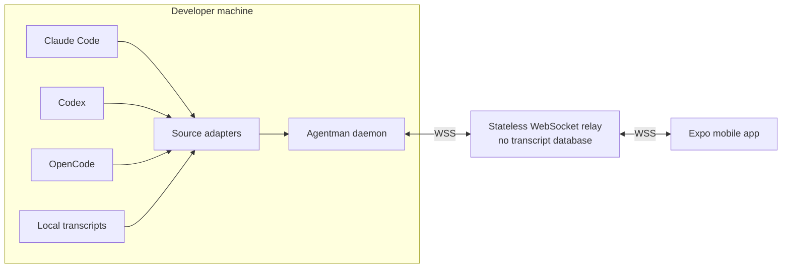
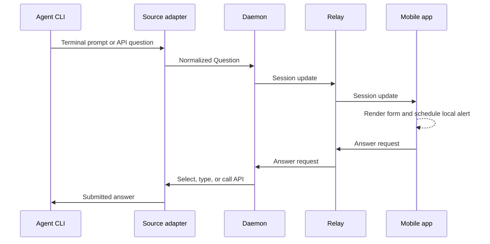

<div align="center">


# agentman

**Monitor and control local coding agents from your phone.**

[](LICENSE)
[](https://go.dev)
[](https://expo.dev)

</div>

Agentman connects Claude Code, Codex, and OpenCode sessions on a computer to an
Expo mobile app. It provides live session state, transcript history, message
delivery, interactive question forms, and local notifications.

## Features

- Discover active Claude Code, Codex, and OpenCode sessions.
- Stream the active session and page older messages from local transcripts.
- Send instructions through tmux or an agent's native API.
- Answer single-select, multi-select, custom-text, preview, and review forms.
- Receive local notifications when an agent completes a turn or needs input.
- Pair a phone without creating an account.
- Self-host a stateless relay with no transcript database.

## Quick start

### 1. Install the CLI

```bash
brew install lenajeremy/agentman/agentman
```

Or build it from source:

```bash
git clone https://github.com/lenajeremy/agentman.git
cd agentman
go build -o bin/am ./cmd/am
```

Source builds require Go 1.26.6. Install `tmux` to send messages to Claude Code
or Codex and to answer their terminal prompts:

```bash
brew install tmux
```

### 2. Configure hooks and start the daemon

```bash
am install-hooks
am serve
```

`am serve` connects to the public relay by default. Keep it running while using
the mobile app.

### 3. Run the mobile app

The app uses Expo SDK 54 and Node.js 24.

```bash
cd mobile
npm ci --legacy-peer-deps
npx expo start
```

Open the project in Expo Go. Changes to the JavaScript bundle are delivered by
Metro during development.

### 4. Pair the phone

With the daemon running, open another terminal:

```bash
am pair
```

Scan the QR code in the app or enter the displayed code. Pairing codes are
single-use and expire after 60 seconds.

### 5. Start an agent

Use the wrappers when the session must accept messages or answers from the app:

```bash
am claude
am codex
am opencode
```

The underlying CLI must already be installed and authenticated.

## Architecture



The daemon is the system's source of truth. It discovers sessions, reads local
transcripts, follows live output, normalizes agent-specific data, and executes
messages and answers. The relay authenticates peers and forwards frames. The
mobile app requests history, subscribes to live updates, and renders the shared
protocol.

### Question flow



### Components

| Component | Location | Responsibility |
|---|---|---|
| CLI and daemon | [`cmd/am`](cmd/am), [`internal/daemon`](internal/daemon) | Discovery, history, live updates, hooks, pairing, and request handling |
| Agent adapters | [`internal/source`](internal/source) | Translate each agent's files, terminal UI, or API into the shared protocol |
| Terminal integration | [`internal/tmux`](internal/tmux), [`internal/question`](internal/question) | Capture prompts and safely drive interactive terminal forms |
| Relay | [`cmd/relay`](cmd/relay), [`internal/relay`](internal/relay) | Authenticate and route live frames without persistent transcript storage |
| Protocol | [`internal/protocol`](internal/protocol) | Shared session, message, question, and frame contracts |
| Mobile app | [`mobile`](mobile) | Pairing, session list, transcript UI, controls, and local notifications |

### Architecture decisions

| Decision | Consequence |
|---|---|
| Transcripts remain on the developer machine. | History is read on demand; the app has no history when the daemon is offline. |
| The relay has no transcript database. | Restarts discard connections and pending pairings, but not user history. |
| The daemon normalizes every agent behind a source adapter. | Agent-specific formats do not leak into the relay or mobile UI. |
| Only the visible session is followed live. | Idle sessions do not continuously stream transcript data. |
| Terminal parsing is conservative. | Ambiguous terminal text is ignored instead of being exposed as a false question. |
| The daemon posts push notifications straight to Expo. | Alerts reach a suspended phone without the relay seeing them, but the daemon needs outbound internet. Falls back to local notifications when no device is registered. |
| Transport uses TLS without end-to-end payload authentication or encryption. | A relay operator can inspect, alter, or inject live control traffic; self-host when that trust boundary is unacceptable. |

## Agent adapters

| Agent | Discovery and history | Message delivery | Questions |
|---|---|---|---|
| Claude Code | Session registry and transcript JSONL | tmux while active; hook queue between turns | tmux prompt parser and terminal control |
| Codex | Rollout JSONL plus tmux discovery before the first rollout exists | tmux | tmux prompt parser and terminal control |
| OpenCode | Native HTTP API across the watched local port range | `prompt_async` API | Native question and permission APIs |

Claude Code and Codex should be started with `am claude` or `am codex` when
two-way control is required. Their CLIs do not expose a general input API, so
the wrapper creates a managed tmux session. `am opencode` instead starts the
OpenCode HTTP server on loopback in the daemon's watched port range.

Question data is normalized into one protocol shape. Depending on the agent and
prompt, it can include option descriptions, checkbox state, custom text,
multiline previews, and the final answer-review summary. Multi-question Claude
forms are driven using their actual tab and focus model rather than assuming
that every screen has an inline submit option.

### Completion detection

- Claude Code uses its `Stop` hook.
- Codex uses its `agent-turn-complete` notification callback.
- OpenCode and missed callbacks fall back to a busy-to-idle transition.
- Pending questions suppress completion alerts so one blocked prompt does not
  also appear as a completed turn.

`am install-hooks` updates `~/.claude/settings.json` and
`~/.codex/config.toml`. Writes are atomic, private, and limited to Agentman's
entries. Existing user-owned Codex notification commands are preserved.

Preview changes before writing configuration:

```bash
am install-hooks -dry-run
```

Remove only Agentman's entries with:

```bash
am uninstall-hooks
```

## CLI reference

```text
am list                     List running sessions
am watch [session-id]       Follow all sessions or one session
am history <session-id>     Print recent messages
am send <session-id> <text> Send a message
am serve                    Run the daemon and relay client
am pair                     Create a mobile pairing code
am claude [args...]         Start Claude Code in managed tmux
am codex [args...]          Start Codex in managed tmux
am opencode [args...]       Start OpenCode with its local API
am install-hooks            Install completion hooks
am uninstall-hooks          Remove Agentman hooks
am doctor                   Validate the local setup
am version                  Print the CLI version
```

History cursors are opaque and can be used to request an older page:

```bash
am history claude:abc123 -limit 20
am history claude:abc123 -limit 20 -before 319250377
```

### Relay selection

The relay is resolved in this order:

1. `-relay <url>`
2. `AGENTMAN_RELAY`
3. `https://agentman-production.up.railway.app`

Use `-relay none` to run the daemon without a phone connection.

### OpenCode configuration

`am opencode` binds OpenCode to loopback and selects a free watched port. For a
separately managed OpenCode server, configure:

| Variable | Purpose |
|---|---|
| `AGENTMAN_OPENCODE_URL` | Explicit OpenCode server URL |
| `OPENCODE_SERVER_USERNAME` | HTTP basic-auth username |
| `OPENCODE_SERVER_PASSWORD` | HTTP basic-auth password |

When `OPENCODE_SERVER_PASSWORD` is set, `AGENTMAN_OPENCODE_URL` is required.
Agentman will not broadcast a Basic-auth credential while scanning the watched
port range.

## Mobile development

```bash
cd mobile
npm ci --legacy-peer-deps
npx expo start
```

For a connected iPhone release build:

```bash
APPLE_TEAM_ID=<team-id> npm run device
```

The default build removes the Apple push entitlement so a free Apple developer
team can sign it. Such a build still alerts, but only through local
notifications fired while the WebSocket is alive — nothing arrives once iOS
suspends the app.

Set `APPLE_PUSH=1` with a paid team to keep the entitlement. The app then hands
the daemon an Expo push token, and the daemon posts alerts directly to Expo
when a turn completes or an agent becomes blocked on a question. The relay is
not involved, so a self-hosted relay needs no push configuration.

Push payloads carry a session name and a reason, never transcript content,
because they pass through Expo and Apple. To include a short excerpt, set
`push.includePreview` in `~/.agentman/config.json`:

```json
{ "push": { "includePreview": true } }
```

### EAS builds

```bash
cd mobile
npx eas-cli@latest build --platform ios --profile production
npx eas-cli@latest submit --platform ios --profile production
```

The first build prompts for Apple credentials and stores them with EAS.

## Self-hosting the relay

The public relay can observe and alter live frame payloads, including control
requests. Deploy a private relay when that trust boundary is not acceptable.
Remote relay URLs must use HTTPS/WSS; plaintext HTTP/WS is accepted only for a
loopback development relay.

### Docker

```bash
docker build -t agentman-relay .
docker run -p 8080:8080 \
  -e AGENTMAN_RELAY_SECRET="$(openssl rand -hex 32)" \
  agentman-relay
```

### Railway

```bash
railway up
railway variables --set "AGENTMAN_RELAY_SECRET=$(openssl rand -hex 32)"
railway domain
```

| Variable | Required | Description |
|---|---|---|
| `AGENTMAN_RELAY_SECRET` | Yes | Stable signing secret, at least 16 characters |
| `PORT` | No | HTTP port; defaults to `8080` |
| `AGENTMAN_TRUST_PROXY` | No | Trust `X-Forwarded-For` only behind a proxy that overwrites it |

Changing `AGENTMAN_RELAY_SECRET` invalidates existing device tokens. Set
`AGENTMAN_TRUST_PROXY=1` on Railway; do not enable it on a directly exposed
relay where clients can supply forwarding headers.

## Security model

- Relay and clients authenticate every endpoint with bearer credentials or a
  single-use pairing secret.
- Typed pairing codes are rate-limited, single-use, and expire after 60
  seconds. The QR path uses an independent high-entropy token.
- Device credentials are signed and verified without a device database. They
  expire after one year and cannot be revoked individually before expiry.
- Hook calls use a token stored in a private file rather than command-line
  arguments.
- Native app credentials use Expo SecureStore. Web builds use browser storage.
- WebSocket payloads are protected by TLS in transit but are not end-to-end
  authenticated or encrypted from daemon to app. A compromised relay can
  inspect traffic and issue agent-control requests.
- Wire protocol v2 rejects incompatible clients before forwarding their
  requests, preventing a partially compatible app from answering stale forms.
- The relay does not persist transcripts, messages, or notification payloads.

## Development

Run the same checks used by CI:

```bash
gofmt -l ./cmd ./internal
go vet ./...
go mod tidy
git diff --exit-code -- go.mod go.sum
go test -race ./...
go build ./cmd/am ./cmd/relay

cd mobile
npm ci --legacy-peer-deps
node scripts/check-npm-audit.mjs
npx expo install --check
npx tsc --noEmit
npm test
```

Terminal parser tests use captured real prompts in
[`internal/question/testdata`](internal/question/testdata). Optional live tests
are guarded by environment variables documented beside the tests.

The primary extension point is [`source.Source`](internal/source/source.go).
Add an adapter under `internal/source`, register it in the CLI, and keep
agent-specific behavior inside that adapter.

## Release

Push a semantic version tag to run GoReleaser:

```bash
git tag v0.4.0
git push origin v0.4.0
```

The release workflow tests and cross-compiles the CLI, publishes GitHub
artifacts, and updates the Homebrew tap. It requires a `HOMEBREW_TAP_TOKEN`
repository secret with write access to the tap.

## License

[MIT](LICENSE)
