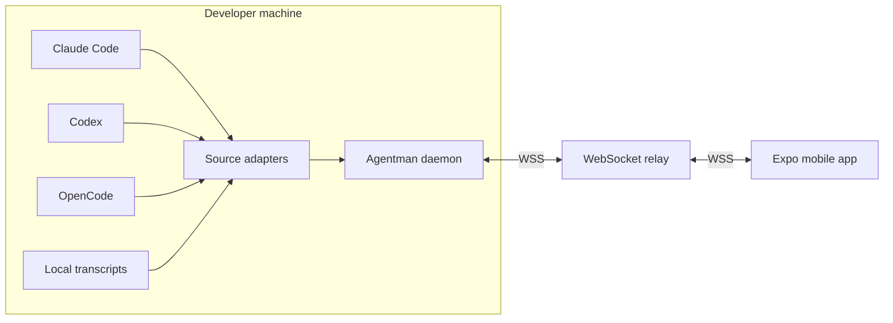
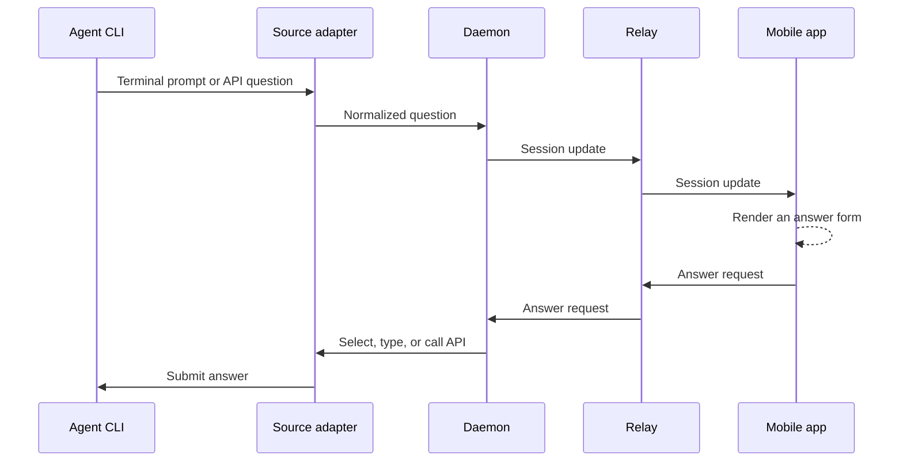

# Architecture

Agentman has three runtime components: a daemon on the developer machine, a
relay reachable from the internet, and a mobile app. The daemon owns all agent
integration logic. The relay only authenticates peers and forwards live frames.

## System overview

The relay has no persistent transcript or account database. It does retain
volatile connection, pairing, last-seen, and bounded queue state in memory.
Restarting it discards that state.

## Components

| Component | Location | Responsibility |
|---|---|---|
| CLI and daemon | [`cmd/am`](../cmd/am), [`internal/daemon`](../internal/daemon) | Discovery, history, subscriptions, hooks, pairing, and command handling |
| Source adapters | [`internal/source`](../internal/source) | Convert agent files, terminal state, and APIs into the shared protocol |
| Terminal integration | [`internal/tmux`](../internal/tmux), [`internal/question`](../internal/question) | Launch managed sessions, inspect prompts, and send safe terminal input |
| Relay | [`cmd/relay`](../cmd/relay), [`internal/relay`](../internal/relay) | Authenticate peers and route frames without durable message storage |
| Protocol | [`internal/protocol`](../internal/protocol) | Session, message, question, request, event, and control contracts |
| Push | [`internal/push`](../internal/push) | Post background notifications directly from the daemon to Expo |
| Speech | [`internal/speech`](../internal/speech) | Prepare hook-reported completed turns for speech and play generated audio |
| Mobile app | [`mobile`](../mobile) | Pairing, session list, transcript UI, forms, controls, and notifications |

## Session flow

1. Each adapter discovers sessions from local files, processes, tmux, or an API.
2. The daemon publishes normalized session summaries to connected app devices.
3. An app subscribes when it opens a session. Subscriptions are reference-counted
   across devices, so only subscribed sessions are followed live.
4. Older history is requested from the daemon in pages.
5. Messages, answers, and interrupts return through the relay to the adapter
   that owns the session.

The app retains already-fetched messages in an in-memory cache, capped at 1,000
messages per session. It does not maintain a durable phone-side transcript
cache, so that cache disappears when the app process restarts.

## Question flow

Terminal parsing is intentionally conservative. Agentman re-reads a prompt
immediately before applying an answer and rejects stale or ambiguous forms
instead of risking input into the wrong terminal state.

## Notifications

Local notifications are scheduled by the app while it is running and connected.
For a signed build with push enabled, the app registers an Expo token with the
daemon. The daemon then posts completion and blocked-question alerts directly
to Expo, without routing those notification payloads through the relay.

Push notifications contain a session name and reason by default. Transcript
preview text is opt-in. See [Mobile setup](mobile.md) and
[Configuration](configuration.md).

The app sends its Expo push token to the daemon through the relay during
registration. Notification delivery then bypasses the relay.

## Design decisions

| Decision | Consequence |
|---|---|
| The daemon is the source of truth. | Agent-specific files and APIs stay on the developer machine, while requested live content still traverses the relay. |
| The relay has no durable user database. | A relay restart loses connections and pending pairings, not local transcripts. |
| Adapters normalize agent state. | The relay and app use one protocol, but adding an agent still requires protocol registration and mobile presentation support. |
| Only subscribed sessions are followed. | Idle sessions do not continuously stream transcript data. Multiple devices may subscribe to different sessions. |
| Terminal control fails closed. | If Agentman cannot prove that a prompt is current and safe, it refuses to send input. |
| Push bypasses the relay. | A suspended phone can receive alerts, but Expo and the platform push provider become part of the notification trust boundary. |
| Transport uses TLS without end-to-end protection. | A relay operator can inspect or modify live frames. Self-host when that trust is unacceptable. |
